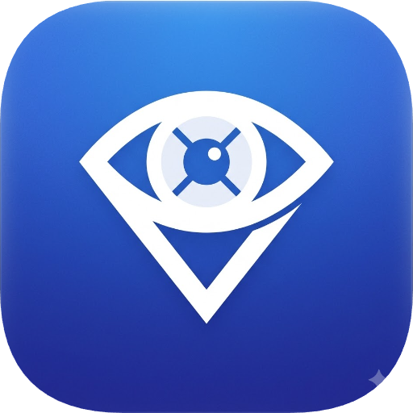

# visionHelper

<p align="center">
  
</p>

> 项目号：`VH-2026-001` · 版本：`1.0.1` · 作者：IceCoke · 协议：MIT

围绕 YOLO 数据生产与训练流程的轻量级视觉辅助工具集，将**视频抽帧、图片去重、数据增强、标注统计、自动标注、标注清除、YOLO 数据集导出、模型训练、模型预测**等步骤整合到统一 CLI/API 及图形界面中。

---

## 架构概览

项目由两个互不依赖的子包构成：

- **`scripts/`** — 核心工具包，纯 CLI/编程接口，`import scripts` **零副作用**。重型依赖（torch/ultralytics/cv2）均在方法体内懒加载。
- **`gui/`** — 基于 PyQt5 的桌面图形界面，通过子进程调用 `python -m scripts.vh` 执行任务，不直接 import 深度学习栈。

> 设计约束：`scripts` 不依赖 `gui`；`gui` 不 `import scripts.api`，也不直接 import `torch` / `ultralytics` / `cv2` 等重型依赖。GUI 可按需 import `scripts.common.*` 轻量工具模块。

---

## 功能一览

| 功能 | CLI 命令 | 实现位置 |
|------|----------|----------|
| 视频抽帧 | `vh.py images import` | `scripts/images/import_.py` |
| 图片去重 | `vh.py images dedup` | `scripts/images/dedup.py` |
| 数据增强 | `vh.py images augment` | `scripts/images/augment.py` |
| 标注统计 | `vh.py datasets stats` | `scripts/datasets/stats.py` |
| 自动标注 | `vh.py datasets auto` | `scripts/datasets/auto.py` |
| 标注清除 | `vh.py datasets clear` | `scripts/datasets/clear.py` |
| YOLO 数据集导出 | `vh.py datasets export` | `scripts/datasets/export.py` |
| 模型训练 | `vh.py train run` | `scripts/train/train.py` |
| 模型预测 | `vh.py predict run` | `scripts/predict/predict.py` |

支持 4 种 YOLO 任务：`detect` / `obb` / `segment` / `classify`。

---

## 快速开始

### 安装依赖

```bash
pip install -r requirements.txt
```

按需拆分：`requirements.txt`（完整）、`requirements-gui.txt`（仅 GUI）、`requirements-dev.txt`（测试）。

### 命令行

```bash
# 视频抽帧
python scripts/vh.py images import --input video.mp4 --output frames/ --frame-step 5

# 图片去重（phash 轻量后端）
python scripts/vh.py images dedup --input images/ --backend phash --threshold 0.95

# 自动标注
python scripts/vh.py datasets auto --input images/ --model best.pt --task detect

# 标注统计
python scripts/vh.py datasets stats --input images/

# 标注清除（默认拒绝执行，需显式指定类型；可先 --dry-run 预演）
python scripts/vh.py datasets clear --input images/ --include-auto --dry-run

# 导出 YOLO 数据集
python scripts/vh.py datasets export --input images/ --output .dataset --task detect

# 模型训练
python scripts/vh.py train run --data .dataset/data.yaml --model yolov8n --epochs 100

# 模型预测
python scripts/vh.py predict run --model best.pt --input test.jpg --output results/
```

### Python API

```python
from scripts.api import VideoAPI, ImageAPI, AnnotationAPI, TrainingAPI, PredictAPI

VideoAPI.extract_video_frames(input_video="video.mp4", output_dir="frames/", frame_step=5)
ImageAPI.deduplicate(folder="images/", backend="phash", hash_size=16)
AnnotationAPI.annotation_stats("images/")
TrainingAPI.export_yolo_dataset(input_dir="images/", output_dir=".dataset", task="detect")
TrainingAPI.train_model(dataset_yaml=".dataset/data.yaml", task="detect", model="yolov8n", epochs=100)
PredictAPI.predict(model_path="best.pt", input_path="test.jpg", output_dir="results/")
```

### 启动图形界面

```bash
python -m gui.app        # 开发态
python gui_main.py       # 等价入口
```

启动后先在欢迎页选择工作目录，再通过顶部菜单栏切换功能页面。

---

## 标注类型判定

`scripts/common/annotation_type.py` 依据 JSON 中 `auto_annotated_time` 字段与文件 mtime 的差值，将标注分为三种：

| 类型 | 含义 |
|------|------|
| `manual` | 手动标注（无 `auto_annotated_time` 字段） |
| `auto` | 自动标注，未被人工修改 |
| `auto_corrected` | 自动标注后被人为修改 |

容差通过 `--tolerance-seconds` 控制（默认 2.0s），被自动标注与标注清除共用。

---

## 项目结构

```
visionHelper/
├── README.md
├── LICENSE
├── pyproject.toml                    # pytest 配置
├── requirements*.txt                 # 依赖管理
├── gui_main.py                       # PyInstaller 入口
├── visionHelper.spec                 # PyInstaller 构建配置
├── scripts/                          # ★ 核心工具包
│   ├── vh.py                         # 统一 CLI 入口与命令行路由
│   ├── api.py                        # 对外编程接口
│   │
│   ├── common/                       # 公共基础模块
│   │   ├── config.py                 # 后端常量（任务类型、扩展名等）
│   │   ├── utils.py                  # IO/路径/迭代器工具
│   │   ├── logging.py                # 日志与进度条（替代 tqdm）
│   │   ├── annotation_type.py        # 标注类型判定
│   │   ├── train_config.py           # 训练配置数据类
│   │   └── sahi_config.py            # SAHI 切片推理配置
│   │
│   ├── images/                       # 图片资源处理
│   │   ├── import_.py                # 视频抽帧
│   │   ├── dedup.py                  # 图片去重
│   │   └── augment.py                # 数据增强（旋转/切割/遮挡/通道）
│   │
│   ├── datasets/                     # 数据集制作
│   │   ├── stats.py                  # 标注统计（JSON 输出）
│   │   ├── auto.py                   # 自动标注（YOLO→X-AnyLabeling）
│   │   ├── clear.py                  # 标注清除
│   │   └── export.py                 # YOLO 数据集导出
│   │
│   ├── train/                        # 模型训练
│   │   └── train.py                  # Ultralytics YOLO 训练
│   │
│   ├── predict/                      # 模型推理
│   │   └── predict.py                # 图片/视频预测
│   │
│   └── deploy/                       # 模型部署（预留）
│       └── deploy.py
│
├── gui/                              # ★ 图形界面（PyQt5）
│   ├── app.py                        # 主窗口 + 菜单栏 + 页面切换
│   ├── context.py                    # 全局上下文（AppContext）
│   ├── theme.py                      # 主题系统（颜色/字体/QSS）
│   ├── config.py                     # GUI 常量与运行路径解析
│   ├── settings.py                   # QSettings 持久化
│   │
│   ├── assets/                       # 应用资源
│   │   ├── icon.png                  # Linux/开发态图标
│   │   ├── icon.ico                  # Windows 图标
│   │   └── icon.icns                 # macOS 图标
│   │
│   ├── components/                   # 公共 UI 组件
│   │   ├── widgets.py                # 按钮/表单行/统计项等
│   │   └── run_log.py                # 运行日志弹窗（QProcess 管理）
│   │
│   ├── pages/                        # 功能页面
│   │   ├── base.py                   # 页面基类（BasePage / BaseTaskPage）
│   │   ├── welcome.py                # 启动引导页（历史工作目录）
│   │   ├── video_frame.py            # 视频抽帧 + 去重 + 增强
│   │   ├── data_annotation.py        # 标注统计 + 清除
│   │   ├── model_training.py         # 数据集导出 + 训练
│   │   ├── predict.py                # 模型预测
│   │   └── about.py                  # 关于页（版本/环境信息）
│   │
│   └── utils/                        # GUI 内部工具
│       └── _proc.py                  # 子进程参数构造
│
└── tests/                            # pytest 测试套件
    ├── conftest.py
    ├── test_annotation_type.py
    ├── test_auto_annotate.py
    ├── test_clear_annotations.py
    ├── test_common_iters.py
    ├── test_deduplicate_phash.py
    ├── test_export_yolo_dataset.py
    ├── test_gui_proc.py
    └── test_images_augment.py
```

---

## 构建与启动

### 直接启动（开发态）

```bash
pip install -r requirements.txt
python -m gui.app        # 方式一
python gui_main.py       # 方式二（等价）
```

### PyInstaller 打包

GUI 可独立打包为可执行文件，不含 torch/ultralytics 等重型依赖：

```bash
pip install -r requirements-gui.txt pyinstaller
pyinstaller --noconfirm --clean visionHelper.spec
```

打包完成后，将仓库根目录的 `scripts/` 拷贝到产物目录：

```bash
# Linux / macOS
cp -r scripts dist/visionHelper/
find dist/visionHelper/scripts -type d -name __pycache__ -prune -exec rm -rf {} +

# Windows (PowerShell)
Copy-Item -Recurse scripts dist/visionHelper/
Get-ChildItem dist/visionHelper/scripts -Recurse -Directory -Filter __pycache__ | Remove-Item -Recurse -Force
```

产物结构：

```
dist/visionHelper/
├── visionHelper(.exe)    ← GUI 可执行文件
├── _internal/            ← PyInstaller 运行时
└── scripts/              ← 脚本源码（运行期由用户 Python 解释器加载）
```

运行时在 GUI 顶部"Python 环境"指定安装了 torch/ultralytics 等依赖的解释器路径即可。

#### macOS 额外步骤

若需生成 `.app` Bundle 以支持双击启动：

```bash
pyinstaller --noconfirm --clean --windowed visionHelper.spec
# 将 scripts/ 拷贝到 .app 内部
cp -r scripts dist/visionHelper.app/Contents/MacOS/
```

首次运行若被 Gatekeeper 拦截：

```bash
xattr -dr com.apple.quarantine dist/visionHelper.app
```

---

## 开发约定

- 业务逻辑放在 `scripts/<subpackage>/<feature>.py` 中；`scripts/vh.py` 仅做统一入口与路由。
- 每个功能通过 `scripts/api.py` 中的 API 类方法对外暴露，方法体内懒加载重型依赖。
- `scripts/` 各 `__init__.py` 必须保持零副作用，禁止 import 重型子模块。
- `gui/` 通过子进程调用 `python -m scripts.vh` 执行任务，耗时操作不阻塞 UI。
- 数据集标注格式基于 X-AnyLabeling JSON（兼容 LabelMe）。

### 测试

```bash
pip install -r requirements.txt
pip install -r requirements-dev.txt
pytest
```
